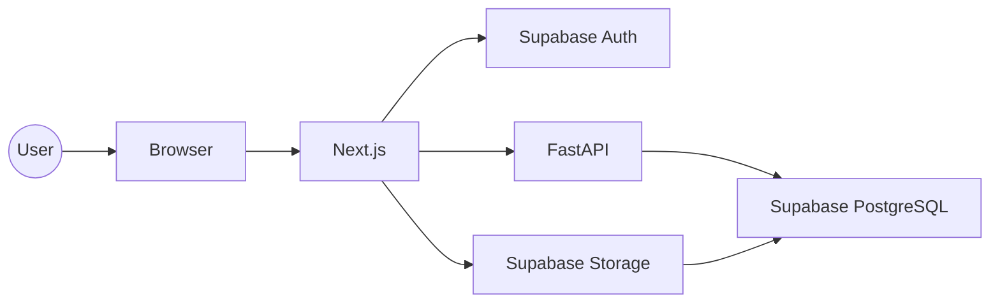
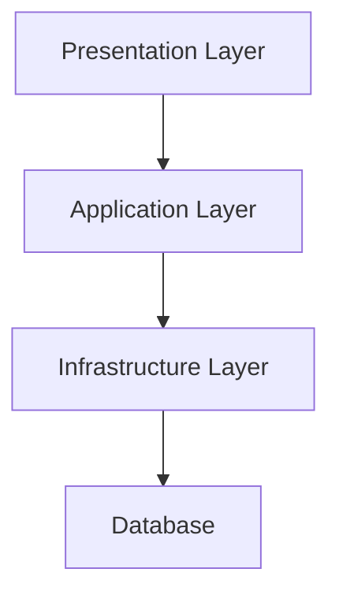
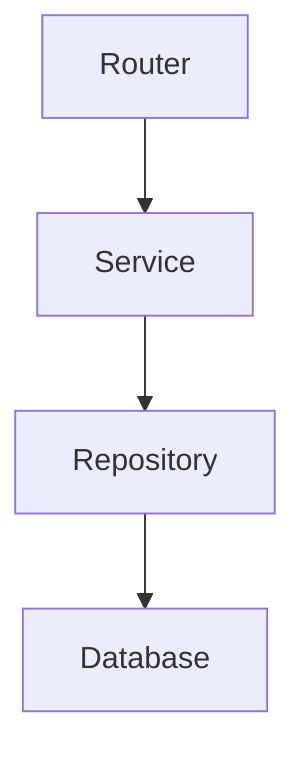
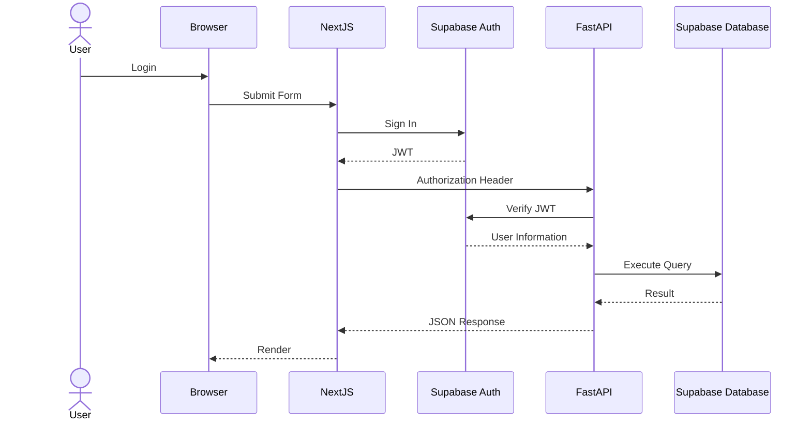
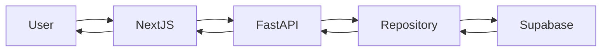
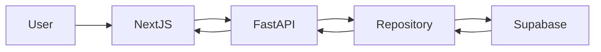

# Architecture

> **Shogi Record** システムアーキテクチャ設計書
>
> Version: 1.0.0  
> Last Updated: 2026-07-05

---

# 1. はじめに

## 1.1 本ドキュメントについて

本ドキュメントでは、本プロジェクト全体のシステム構成、設計思想、および各コンポーネントの責務について説明します。

本書は実装者向けの設計書であり、実装時に常に参照されることを前提としています。

本プロジェクトでは、設計と実装が乖離しないことを重要な目標とし、設計変更が発生した場合は本ドキュメントを更新します。

---

# 2. プロジェクト概要

## 2.1 目的

本プロジェクトは、ネット将棋の対局履歴を一元管理し、日々の振り返りや棋力向上を支援するWebアプリケーションです。

多くのネット将棋サービスでは対局履歴の閲覧は可能ですが、

- 複数サービスを横断した管理
- 自分用のメモ
- タグ管理
- 戦法別の分析
- レーティング推移
- 長期的な統計

などを一つの場所で管理することは困難です。

本システムでは、それらを一元管理できる環境を提供します。

---

## 2.2 対応プラットフォーム

Version 1では以下のサービスに対応します。

|サービス|対応|
|-------|----|
|将棋ウォーズ|✅|
|将棋クエスト|✅|
|棋桜|✅|
|81Dojo|✅|

対応サービスはマスターテーブルで管理し、将来的な追加を容易にします。

---

## 2.3 Version 1 の対象機能

Version 1では以下の機能を実装します。

### 認証

- サインアップ
- ログイン
- ログアウト
- パスワードリセット

認証には Supabase Auth を利用します。

---

### 対局管理

- 対局登録
- 編集
- 削除
- 一覧表示
- 詳細表示

---

### 棋譜管理

保存形式

- KIF
- KI2
- CSA
- SFEN

---

### タグ

任意タグを付与できます。

例

- 研究
- 時間切れ
- 快勝
- 終盤

---

### 戦法管理

戦法マスタを用いて

- 四間飛車
- 相掛かり
- 矢倉

などを管理します。

---

### 統計

表示予定

- 総対局数
- 勝率
- 先手勝率
- 後手勝率
- 戦法別勝率
- 月別対局数

---

# 3. Version 2以降

Version 2では以下を追加予定です。

## AI解析

USIエンジンを利用した

- 評価値
- 最善手
- 悪手判定

---

## 棋譜共有

URL共有

公開設定

閲覧権限

---

## SNS機能

- フォロー
- コメント
- いいね

---

## PWA

スマートフォン向けにホーム画面追加をサポートします。

---

# 4. 技術スタック

|レイヤー|採用技術|
|---------|---------|
|Frontend|Next.js(App Router)|
|Language|TypeScript|
|UI|Tailwind CSS|
|Component|shadcn/ui|
|Backend|FastAPI|
|ORM|SQLAlchemy|
|Migration|Alembic|
|Database|Supabase PostgreSQL|
|Authentication|Supabase Auth|
|Storage|Supabase Storage|
|Container|Docker|
|Package Manager|pnpm / uv|

---

# 5. 技術選定理由

## Next.js

採用理由

- App Routerによる柔軟なルーティング
- Server Components対応
- TypeScriptとの親和性
- 高い開発生産性
- 将来的なSSR対応

採用しなかった候補

- React + Vite
- Nuxt
- Remix

---

## FastAPI

採用理由

- 型安全
- OpenAPI自動生成
- 高速
- Python資産を利用できる
- 将来的なAI解析との親和性

採用しなかった候補

- Django REST Framework
- Flask
- Express
- NestJS

---

## Supabase

採用理由

- PostgreSQLを利用できる
- Authが統合されている
- Storageを利用できる
- RLSが利用できる
- 管理画面が使いやすい

採用しなかった候補

- Firebase
- Appwrite
- Neon + Auth.js

---

# 6. 設計理念

本プロジェクトでは、以下の設計原則を採用します。

## Single Responsibility Principle

一つのモジュールは一つの責務のみを持ちます。

例

- RouterはHTTPのみ
- Serviceはビジネスロジックのみ
- RepositoryはDBアクセスのみ

---

## Separation of Concerns

以下を明確に分離します。

- UI
- 認証
- ビジネスロジック
- データアクセス
- 永続化

---

## API First

API仕様を先に設計します。

これにより、

- フロントエンド
- バックエンド

を独立して開発できます。

---

## Type Safety

全レイヤーで型安全を重視します。

Frontend

- TypeScript

Backend

- Pydantic

Database

- SQLAlchemy

---

## Extensibility

Version2以降の

- AI解析
- 棋譜共有
- SNS

を想定し、拡張しやすい構造を採用します。

---

# 7. システム全体構成



---

# 8. アーキテクチャ概要

本システムでは、フロントエンド・認証・バックエンド・データベースを明確に分離します。

各コンポーネントは以下の責務を持ちます。

|コンポーネント|責務|
|--------------|----|
|Next.js|UI・画面遷移・API通信|
|Supabase Auth|認証・JWT発行・セッション管理|
|FastAPI|ビジネスロジック・API提供|
|Supabase PostgreSQL|データ永続化|
|Supabase Storage|プロフィール画像などのファイル保存|

FastAPIは単なるCRUD APIではなく、本システムのビジネスロジックを集約する中核コンポーネントとして設計します。

---

# 9. アーキテクチャ設計

## 9.1 基本方針

ShogiLogでは、責務を明確に分離したレイヤードアーキテクチャを採用します。

各レイヤーは独立した責務を持ち、上位レイヤーは下位レイヤーにのみ依存します。



---

## 9.2 レイヤー構成

|レイヤー|責務|
|---------|----|
|Presentation|HTTP・画面・API|
|Application|ビジネスロジック|
|Infrastructure|DB・Storage・外部サービス|
|Database|データ永続化|

---

# 10. FastAPI アーキテクチャ

FastAPIでは以下の構成を採用します。



各レイヤーの責務を以下に示します。

---

## Router

HTTPリクエストを受け取り、適切なServiceを呼び出します。

### 責務

- リクエスト受信
- レスポンス返却
- バリデーション
- Dependsの利用

### 責務に含めないもの

- SQL
- ビジネスロジック
- 集計処理

---

## Service

本システムのビジネスロジックを担当します。

### 例

- 対局登録
- タグ付与
- 戦法判定
- 勝率計算
- 統計情報生成

ServiceはRepositoryを利用してデータを取得・更新します。

---

## Repository

Repositoryはデータアクセス層です。

### 責務

- SELECT
- INSERT
- UPDATE
- DELETE

SQLAlchemyおよびSupabaseとの通信はRepositoryのみが担当します。

Serviceから直接SQLを書くことは禁止します。

---

# 11. ディレクトリ構成

## 11.1 リポジトリ構成

```text
shogi-log/

├── backend/
├── frontend/
├── docs/
├── docker/
├── .github/
├── compose.yml
├── README.md
└── .env.example
```

---

## 11.2 Backend構成

```text
backend/

└── app/
    ├── api/
    │   ├── deps/
    │   └── v1/
    │
    ├── core/
    │
    ├── db/
    │
    ├── models/
    │
    ├── repositories/
    │
    ├── schemas/
    │
    ├── services/
    │
    ├── utils/
    │
    └── main.py
```

---

### api/

FastAPI Routerを配置します。

例

- games.py
- tags.py
- ratings.py

---

### core/

システム共通設定です。

例

- config.py
- security.py
- logging.py

---

### db/

DB接続を管理します。

例

- session.py
- base.py

---

### models/

SQLAlchemyモデルを配置します。

モデルは1テーブル1ファイルを基本とします。

---

### repositories/

DBアクセスを担当します。

例

- GameRepository
- RatingRepository
- TagRepository

---

### schemas/

Pydanticモデルを配置します。

用途

- Request
- Response
- Validation

---

### services/

ビジネスロジックを実装します。

例

- GameService
- StatisticsService
- RatingService

---

### utils/

共通処理を配置します。

例

- 日付変換
- SFEN変換
- 共通例外

---

# 12. Frontend構成

```text
frontend/

src/

├── app/
├── components/
├── features/
├── hooks/
├── lib/
├── services/
├── types/
├── utils/
└── middleware.ts
```

---

## app/

App Routerを利用します。

画面単位で管理します。

---

## components/

共通UIです。

例

- Button
- Modal
- Card

---

## features/

機能単位でコンポーネントを管理します。

例

```text
features/

games/

ratings/

profile/

tags/
```

機能ごとの責務を明確にするため、Feature First構成を採用します。

---

## services/

API通信を担当します。

ここではHTTP通信のみを実装します。

ビジネスロジックは実装しません。

---

## hooks/

React Hooksを配置します。

例

- useAuth
- useGames
- useProfile

---

## lib/

ライブラリ初期化を管理します。

例

- supabase.ts
- query-client.ts

---

# 13. 設計原則

本プロジェクトでは以下を禁止事項とします。

- RouterからRepositoryを直接呼び出す
- ServiceからHTTP通信を行う
- SQLをRouterへ書く
- UIからDBへ直接アクセスする
- Repositoryでビジネスロジックを実装する

責務を明確に分離し、保守性とテスト容易性を高めます。

---

# 14. Authentication Architecture

## 14.1 概要

ShogiLogでは認証機能に **Supabase Auth** を採用します。

認証機能をFastAPIへ実装せず、認証とアプリケーションロジックを分離することで保守性と安全性を向上させます。

FastAPIはJWTの検証後、認証済みユーザーとしてリクエストを処理します。

---

## 14.2 Authentication Flow



---

## 14.3 Responsibilities

### Supabase Auth

担当するもの

- Sign Up
- Login
- Logout
- Password Reset
- Email Verification
- Session Management
- JWT発行

---

### FastAPI

担当するもの

- JWT検証
- ビジネスロジック
- API提供
- 権限確認

---

### Frontend

担当するもの

- 認証画面
- Token保持
- API通信
- ログアウト処理

---

# 15. Authorization

認可は以下の2段階で行います。

## Layer 1

FastAPI

現在のユーザーが対象データへアクセス可能か確認します。

---

## Layer 2

Supabase RLS

最終的なアクセス制御をデータベース側で行います。

アプリケーション側の実装ミスがあってもRLSによって不正アクセスを防止します。

---

# 16. Row Level Security

## 基本方針

ユーザーは自分自身のデータのみ取得できます。

例えば games テーブルでは

```text
games.user_id = auth.uid()
```

でアクセス制御します。

---

## 設計例

|Table|Policy|
|------|------|
|profiles|本人のみ|
|games|本人のみ|
|game_records|本人のみ|
|ratings|本人のみ|
|user_openings|本人のみ|

タグや戦法マスタなどの共有データは読み取り専用とします。

---

# 17. Data Flow

## 対局登録



---

## 対局一覧取得



---

# 18. Error Handling

エラーは統一した形式で返却します。

```json
{
  "message": "Game not found.",
  "code": "GAME_NOT_FOUND"
}
```

HTTPステータスはREST APIの標準に従います。

|Status|Meaning|
|-------|--------|
|200|Success|
|201|Created|
|400|Bad Request|
|401|Unauthorized|
|403|Forbidden|
|404|Not Found|
|409|Conflict|
|422|Validation Error|
|500|Internal Server Error|

---

# 19. Logging

ログは用途ごとに分類します。

|種類|内容|状態|
|----|----|----|
|Access Log|HTTPアクセス|実装済み(`backend/app/core/logging.py`, `main.py` の `access_log_middleware`)|
|Error Log|例外|実装済み(`main.py` の `unhandled_exception_handler`)|
|Application Log|業務ログ|各層で `logging.getLogger(__name__)` を使う想定。網羅的な呼び出し追加は未実装|
|Security Log|認証・認可|未実装。401/403もAccess Logの `status_code` に含まれる|

Access Log / Error Log はJSON構造化ログとして標準出力に出力し、以下を含めます。

- Request ID(`X-Request-ID` としてレスポンスヘッダーにも付与)
- User ID(未認証時は `null`)
- Request Path
- HTTP Method
- Response Time(ミリ秒)

詳細な実装は `docs/backend.md` §10 を参照してください。

---

# 20. Security

## 基本方針

以下を必須とします。

- HTTPS
- JWT認証
- Row Level Security
- SQL Injection対策
- Input Validation

---

## Password

パスワードはSupabase Authのみが管理します。

FastAPIではパスワードを保持しません。

---

## Secret

秘密情報はすべて環境変数で管理します。

例

- SUPABASE_URL
- SUPABASE_ANON_KEY
- SUPABASE_SERVICE_ROLE_KEY

---

# 21. Performance

Version1では以下を目標とします。

|項目|目標|
|----|----|
|API Response|500ms以内|
|一覧表示|1秒以内|
|検索|1秒以内|

インデックス設計については database.md に記載します。

---

# 22. Future Extensions

Version2では以下を追加予定です。

- AI解析
- 評価値グラフ
- 最善手表示
- 棋譜共有

Version3では以下を追加予定です。

- フォロー
- コメント
- 公開プロフィール
- PWA対応

現在の設計はこれらの機能追加を考慮した構成となっています。

---

# 23. Architecture Summary

ShogiLogでは以下を設計原則とします。

- レイヤードアーキテクチャ
- Repository Pattern
- Supabase Auth
- Supabase PostgreSQL
- FastAPIによるビジネスロジック集約
- Feature FirstなFrontend構成
- Row Level Securityによるアクセス制御

これらの原則により、保守性・拡張性・可読性を重視したアーキテクチャを実現します。