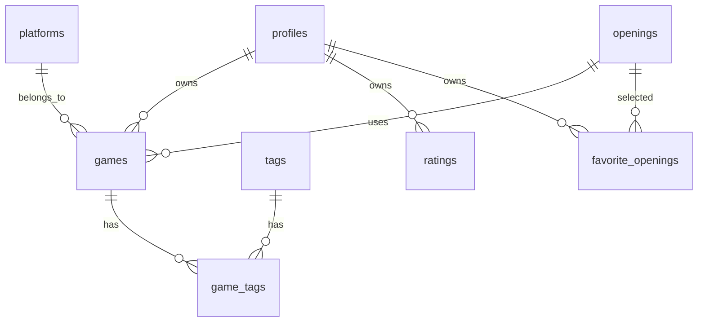

# Database Design

> **ShogiLog データベース設計書**
>
> Version: 1.0.0  
> Status: Draft  
> Last Updated: 2026-07-05

---

# 1. はじめに

## 1.1 本ドキュメントについて

本ドキュメントでは、ShogiLogで利用するデータベースの設計について説明します。

対象はSupabase(PostgreSQL)であり、テーブル構造、リレーション、制約、インデックス、Row Level Security(RLS)などを定義します。

本設計書は実装時の仕様書として利用し、データベース構造に変更があった場合は本書も更新します。

---

# 2. 設計方針

## 2.1 基本方針

ShogiLogでは以下の方針でデータベースを設計します。

- PostgreSQLを利用する
- Supabaseを利用する
- Row Level Security(RLS)を有効化する
- Supabase Authと連携する
- 正規化を基本とする
- 将来的な機能追加を考慮する

ShogiLogでは、データの性質に応じて ENUM型 と マスタテーブル を使い分ける。

ENUMを使用する場合

以下の条件を満たすデータは、PostgreSQLのENUM型で管理する。

- 値の種類が少ない
- 値がほとんど増減しない
- データベース全体で共通して使用する

例

- 戦法カテゴリ（居飛車・振り飛車・その他）
- 対局結果（勝ち・負け・引き分け）
- 先手・後手

ENUMを採用することで、入力ミスを防ぎ、データの整合性を保つことができる。

マスタテーブルを使用する場合

以下の条件を満たすデータは、マスタテーブルとして管理する。

- 将来的に追加・変更される可能性がある
- 説明やURLなど複数の属性を持つ
- 他のテーブルから参照される

例

- 対応プラットフォーム（将棋ウォーズ、将棋クエスト、棋桜、81Dojo）
- 戦法一覧（矢倉、角換わり、四間飛車など）

マスタテーブルは固定IDで管理し、表示名とは別に一意なslugを持たせる。

---

## 2.2 設計目標

本データベースでは以下を重視します。

- 可読性
- 保守性
- 拡張性
- データ整合性
- 高速な検索

---

## 2.3 認証

認証にはSupabase Authを利用します。

ユーザー情報は

- auth.users
- profiles

の2つで管理します。

認証情報はauth.usersが管理し、

プロフィール情報はprofilesで管理します。

---

## 2.4 Row Level Security (RLS)

ShogiLogでは、すべてのテーブルでRow Level Security（RLS）を有効化する。

ユーザーデータは、所有者のみが閲覧・更新できるようにする。
マスタテーブルは、認証済みユーザーに対してSELECTのみ許可し、INSERT・UPDATE・DELETEは許可しない。

これにより、Supabaseのセキュリティモデルに沿った、安全で一貫性のあるデータベース設計を実現する。

---

# 3. 命名規則

## 3.1 テーブル名

すべて複数形・スネークケースを採用します。

例

|OK|NG|
|---|---|
|profiles|profile|
|games|game|
|game_tags|gameTag|
|favorite_openings|favoriteOpening|

---

## 3.2 カラム名

すべてスネークケースを採用します。

例

|OK|NG|
|---|---|
|created_at|createdAt|
|updated_at|updatedAt|
|user_id|userId|

---

## 3.3 Primary Key

すべてUUIDを採用します。

例

```text
id UUID PRIMARY KEY
```

---

## 3.4 外部キー

外部キーは

```
テーブル名_id
```

とします。

例

```text
user_id
platform_id
opening_id
game_id
tag_id
```

---

## 3.5 タイムスタンプ

全テーブルで以下を基本とします。

```text
created_at

updated_at
```

TIMESTAMP WITH TIME ZONEを利用します。

---

## 3.6 論理削除

Version1では論理削除は採用しません。

削除は物理削除とします。

将来的に必要になった場合のみ

```
deleted_at
```

を追加します。

---

# 4. データベース全体構成

Version1では以下のテーブルを作成します。

|テーブル|用途|
|---------|----|
|profiles|プロフィール|
|platforms|将棋サービス|
|openings|戦法マスタ|
|games|対局情報|
|tags|ユーザータグ|
|game_tags|タグ中間テーブル|
|ratings|レーティング履歴|
|favorite_openings|お気に入り戦法|

---

# 5. ER図



---

# 6. テーブル一覧

|テーブル|説明|
|---------|----|
|profiles|ユーザー情報|
|platforms|将棋サービス一覧|
|openings|戦法マスタ|
|games|対局データ|
|tags|タグ|
|game_tags|タグ管理|
|ratings|レーティング履歴|
|favorite_openings|お気に入り戦法|

---

# 7. 共通カラム

複数のテーブルで共通して利用するカラムです。

|カラム|型|説明|
|------|---|----|
|id|UUID|Primary Key|
|created_at|TIMESTAMPTZ|作成日時|
|updated_at|TIMESTAMPTZ|更新日時|

---

# 8. profiles

## 概要

プロフィール情報を保持します。

認証情報(auth.users)とは分離し、

アプリケーションで利用する情報のみ保持します。

---

## カラム

|カラム|型|NULL|説明|
|------|---|----|----|
|id|UUID|NO|auth.users.id|
|display_name|TEXT|NO|表示名|
|bio|TEXT|YES|自己紹介|
|icon_url|TEXT|YES|アイコン画像|
|country|TEXT|YES|国|
|created_at|TIMESTAMPTZ|NO|作成日時|
|updated_at|TIMESTAMPTZ|NO|更新日時|

---

## 制約

Primary Key

```
id
```

Foreign Key

```
profiles.id

↓

auth.users.id
```

---

## 利用箇所

- プロフィール画面

- ユーザー情報表示

- アイコン表示

---

# 9. platforms

## 概要

対応する将棋サービスを管理します。

本テーブルはマスターデータです。

ユーザーによる編集はできません。

---

## 初期データ

|ID|サービス|
|--|---------|
|1|将棋ウォーズ|
|2|将棋クエスト|
|3|棋桜|
|4|81Dojo|

---

## カラム

|カラム|型|NULL|説明|
|------|---|----|----|
|id|SMALLINT|NO|ID|
|name|TEXT|NO|サービス名|
|official_url|TEXT|YES|公式URL|
|created_at|TIMESTAMPTZ|NO|作成日時|

---

## 制約

Primary Key

```
id
```

Unique

```
name
```

---

# 10. openings

## 概要

戦法マスタです。

Version1では管理者のみ追加・更新を行います。

ゲームデータは本テーブルを参照します。

---

## カラム

|カラム|型|NULL|説明|
|------|---|----|----|
|id|UUID|NO|ID|
|name|TEXT|NO|戦法名|
|description|TEXT|YES|説明|
|created_at|TIMESTAMPTZ|NO|作成日時|
|updated_at|TIMESTAMPTZ|NO|更新日時|

---

## 制約

Primary Key

```
id
```

Unique

```
name
```

---

## 利用箇所

- 対局登録
- 対局検索
- 統計画面
- お気に入り戦法

---

# 11. games

## 概要

gamesテーブルはShogiLogの中核となるテーブルです。

ユーザーが登録した対局情報を保持し、統計・検索・戦法分析などの基礎データとして利用します。

Version1では棋譜データも本テーブル内に保持します。

---

## カラム

|カラム|型|NULL|説明|
|------|---|----|----|
|id|UUID|NO|Primary Key|
|user_id|UUID|NO|プロフィールID|
|platform_id|SMALLINT|NO|対局サービス|
|opening_id|UUID|YES|戦法|
|title|TEXT|YES|対局タイトル|
|opponent_name|TEXT|NO|対戦相手名|
|is_sente|BOOLEAN|NO|先手ならtrue|
|result|TEXT|NO|win / lose / draw|
|ended_at|TIMESTAMPTZ|YES|対局終了日時|
|time_control|TEXT|YES|持ち時間|
|memo|TEXT|YES|対局メモ|
|kif_text|TEXT|YES|KIF形式棋譜|
|ki2_text|TEXT|YES|KI2形式棋譜|
|csa_text|TEXT|YES|CSA形式棋譜|
|sfen|TEXT|YES|SFEN|
|created_at|TIMESTAMPTZ|NO|登録日時|
|updated_at|TIMESTAMPTZ|NO|更新日時|

---

## リレーション

|カラム|参照先|
|------|------|
|user_id|profiles.id|
|platform_id|platforms.id|
|opening_id|openings.id|

---

## 制約

Primary Key

```text
id
```

Foreign Key

```text
user_id
    ↓
profiles.id

platform_id
    ↓
platforms.id

opening_id
    ↓
openings.id
```

CHECK

```text
result

↓

win
lose
draw
```

---

## 利用箇所

- 対局登録
- 対局編集
- 対局一覧
- 対局検索
- 統計画面
- ダッシュボード

---

# 12. tags

## 概要

ユーザーが自由に作成できるタグです。

タグはユーザー単位で管理されます。

例

- 研究
- 詰み逃し
- 終盤
- 時間切れ

---

## カラム

|カラム|型|NULL|説明|
|------|---|----|----|
|id|UUID|NO|Primary Key|
|user_id|UUID|NO|所有ユーザー|
|name|TEXT|NO|タグ名|
|color|TEXT|YES|表示色|
|created_at|TIMESTAMPTZ|NO|作成日時|
|updated_at|TIMESTAMPTZ|NO|更新日時|

---

## 制約

Unique

```text
user_id

+

name
```

同じユーザーは同名タグを作成できません。

---

# 13. game_tags

## 概要

対局とタグの多対多リレーションを管理します。

---

## カラム

|カラム|型|NULL|説明|
|------|---|----|----|
|game_id|UUID|NO|対局ID|
|tag_id|UUID|NO|タグID|
|created_at|TIMESTAMPTZ|NO|登録日時|

---

## Primary Key

複合Primary Key

```text
game_id

+

tag_id
```

---

## Foreign Key

```text
game_id
    ↓
games.id

tag_id
    ↓
tags.id
```

---

## 利用箇所

- タグ検索
- タグ一覧
- 対局詳細

---

# 14. ratings

## 概要

レーティング推移を保存します。

各対局終了時点のレーティングを記録することで、グラフ表示や履歴確認を可能にします。

---

## カラム

|カラム|型|NULL|説明|
|------|---|----|----|
|id|UUID|NO|Primary Key|
|user_id|UUID|NO|ユーザー|
|platform_id|SMALLINT|NO|サービス|
|game_id|UUID|YES|対象対局|
|rating|INTEGER|NO|レーティング|
|recorded_at|TIMESTAMPTZ|NO|記録日時|
|created_at|TIMESTAMPTZ|NO|作成日時|

---

## リレーション

```text
user_id

↓

profiles.id

platform_id

↓

platforms.id

game_id

↓

games.id
```

---

## 利用箇所

- レーティング推移
- ダッシュボード
- 統計画面

---

# 15. favorite_openings

## 概要

お気に入り戦法を管理します。

プロフィール画面などで表示するために利用します。

勝率計算には利用しません。

---

## カラム

|カラム|型|NULL|説明|
|------|---|----|----|
|user_id|UUID|NO|ユーザー|
|opening_id|UUID|NO|戦法|
|created_at|TIMESTAMPTZ|NO|登録日時|

---

## Primary Key

複合Primary Key

```text
user_id

+

opening_id
```

---

## Foreign Key

```text
user_id
    ↓
profiles.id

opening_id
    ↓
openings.id
```

---

## 利用箇所

- プロフィール
- ダッシュボード

---

# 16. リレーション一覧

|親テーブル|子テーブル|関係|
|-----------|-----------|----|
|profiles|games|1:N|
|profiles|tags|1:N|
|profiles|ratings|1:N|
|profiles|favorite_openings|1:N|
|platforms|games|1:N|
|platforms|ratings|1:N|
|openings|games|1:N|
|openings|favorite_openings|1:N|
|games|game_tags|1:N|
|tags|game_tags|1:N|

---

# 17. 削除ポリシー

データ削除時の基本方針を以下に示します。

|テーブル|削除方法|
|---------|---------|
|profiles|Supabase Authと連携|
|games|物理削除|
|tags|物理削除|
|game_tags|CASCADE|
|ratings|物理削除|
|favorite_openings|物理削除|

ゲームを削除した場合は、関連する `game_tags` は自動的に削除されます。

---

# 18. データ整合性

以下のルールを保証します。

- 存在しないユーザーの対局は登録できない
- 存在しない戦法は登録できない
- 存在しないプラットフォームは登録できない
- 同一ユーザーは同名タグを複数作成できない
- 同じお気に入り戦法は重複登録できない
- game_tagsで同じ組み合わせは重複登録できない

---

# 19. Row Level Security (RLS)

## 19.1 基本方針

ShogiLogでは、すべてのユーザーデータをRow Level Security(RLS)によって保護します。

ユーザーは自分が所有するデータのみ閲覧・更新・削除できます。

アプリケーション側(FastAPI)でも認可を行いますが、最終的なアクセス制御はデータベース側で実施します。

---

## 19.2 RLS対象テーブル

|テーブル|RLS|
|---------|---|
|profiles|有効|
|games|有効|
|tags|有効|
|game_tags|有効|
|ratings|有効|
|favorite_openings|有効|
|platforms|無効（読み取り専用）|
|openings|無効（読み取り専用）|

---

## 19.3 profiles

ユーザーは自分自身のプロフィールのみ操作できます。

|操作|許可|
|----|----|
|SELECT|本人のみ|
|INSERT|本人のみ|
|UPDATE|本人のみ|
|DELETE|本人のみ|

---

## 19.4 games

games.user_id と auth.uid() が一致するデータのみ操作できます。

|操作|許可|
|----|----|
|SELECT|本人のみ|
|INSERT|本人のみ|
|UPDATE|本人のみ|
|DELETE|本人のみ|

---

## 19.5 tags

タグはユーザー単位で管理します。

他ユーザーのタグは参照できません。

---

## 19.6 game_tags

関連付けられたゲームの所有者のみ操作できます。

---

## 19.7 ratings

本人のみ閲覧・更新できます。

---

## 19.8 favorite_openings

本人のみ操作できます。

---

## 19.9 マスターテーブル

以下のテーブルは全ユーザーが読み取り可能です。

- platforms
- openings

Version1では一般ユーザーによる更新はできません。

---

# 20. インデックス設計

## 20.1 基本方針

検索性能を向上させるため、検索条件として利用するカラムにインデックスを作成します。

---

## profiles

|カラム|用途|
|------|----|
|display_name|プロフィール検索|

---

## games

|カラム|用途|
|------|----|
|user_id|一覧取得|
|platform_id|サービス検索|
|opening_id|戦法検索|
|ended_at|日付検索|
|result|勝敗検索|
|created_at|新着順|

---

## tags

|カラム|用途|
|------|----|
|user_id|タグ一覧|
|name|タグ検索|

---

## ratings

|カラム|用途|
|------|----|
|user_id|履歴取得|
|platform_id|サービス別|
|recorded_at|時系列表示|

---

## favorite_openings

|カラム|用途|
|------|----|
|user_id|一覧取得|
|opening_id|参照|

---

# 21. Seedデータ

## 21.1 platforms

初期データとして以下を登録します。

|ID|名称|
|--|----|
|1|将棋ウォーズ|
|2|将棋クエスト|
|3|棋桜|
|4|81Dojo|

---

## 21.2 openings

Version1では主要戦法を登録します。

例

- 居飛車
- 振り飛車
- 矢倉
- 相掛かり
- 横歩取り
- 角換わり
- 四間飛車
- 三間飛車
- 中飛車
- 向かい飛車
- 石田流
- ゴキゲン中飛車
- 相振り飛車

今後の追加・修正を考慮し、マスターデータとして管理します。

---

# 22. マイグレーション方針

## 基本方針

データベース構造はSupabase Migrationで管理します。

テーブル変更はすべてMigrationとして管理し、本番環境へ直接変更を加えません。

---

## 命名規則

Migration名は変更内容が分かる名前とします。

例

```text
create_profiles_table

create_games_table

create_tags_table

add_opening_index

add_result_check_constraint
```

---

## 運用ルール

- テーブル変更はMigrationを作成する
- 本番DBを直接編集しない
- GitでMigrationを管理する
- Migrationレビューを行う

---

# 23. バックアップ

## 基本方針

データベースはSupabaseのバックアップ機能を利用します。

また、重要なリリース前には手動バックアップを取得します。

---

# 24. データ整合性

以下の整合性を保証します。

- 外部キー制約を利用する
- NULLを必要最小限にする
- 重複登録を防止する
- RLSにより他ユーザーのデータを保護する
- マスターデータはアプリケーションから更新しない

---

# 25. 将来の拡張

Version2以降では以下のテーブル追加を予定しています。

|テーブル|用途|
|---------|----|
|analysis_results|AI解析結果|
|game_comments|対局コメント|
|shared_games|共有棋譜|
|notifications|通知|
|followers|フォロー|
|likes|いいね|

これらの追加を考慮し、Version1では既存テーブルへの依存を最小限に抑えた設計としています。

---

# 26. Database Summary

ShogiLogのデータベース設計では、以下の方針を採用します。

- PostgreSQL（Supabase）を採用
- UUIDを主キーとして利用
- Supabase Authと連携
- RLSによるアクセス制御
- 正規化を基本としたテーブル設計
- 将来の機能追加を考慮した拡張性の高い構造
- マイグレーションによる安全なスキーマ管理

本ドキュメントを基準として、データベースの実装および運用を行います。